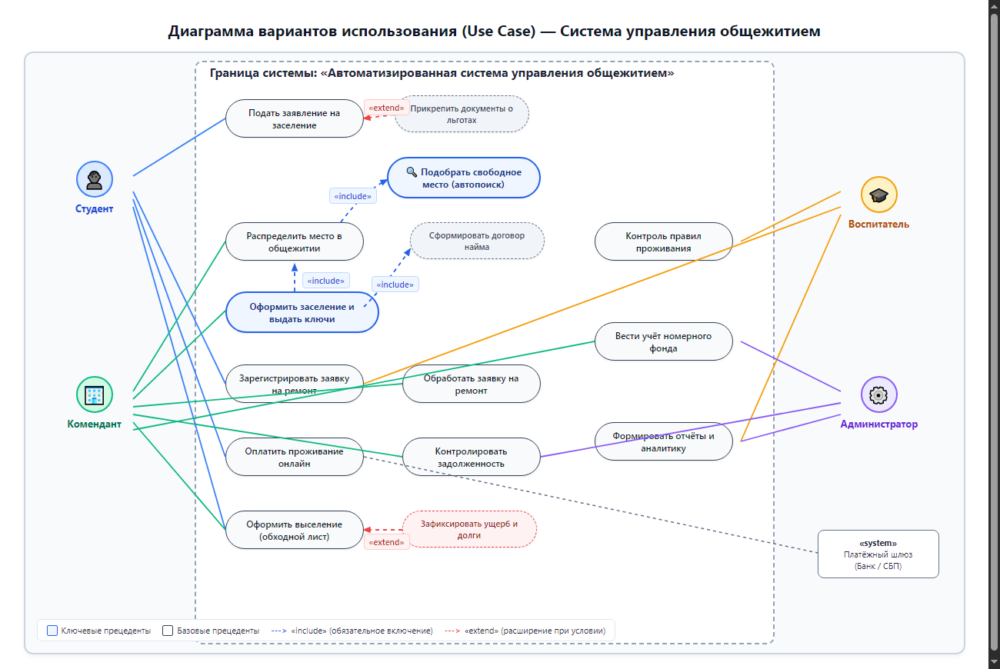
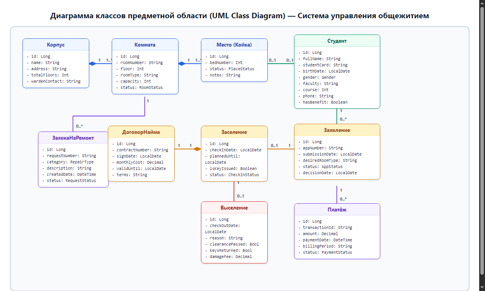
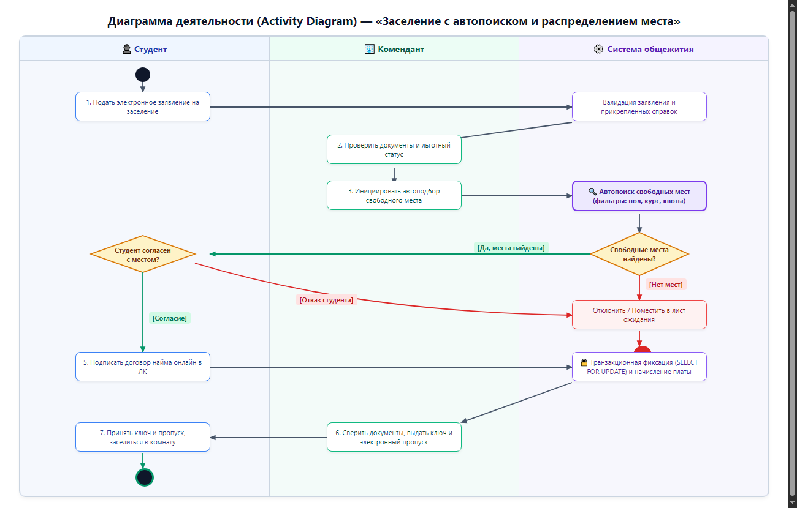

# Отчёт по практической работе №1
## Тема: «Моделирование программного проекта и определение состава разработчиков»

**Дисциплина:** МДК 02.01. Технология разработки программного обеспечения  
**Тема курсового проекта:** Разработка системы управления общежитием  
**Студент:** Витеник П.Л.  
**Группа:** ИТ-31, 3 курс  
**Организация:** Политехнический колледж БГТУ  

---

## 1. Цель работы и краткое описание предметной области

### Цель работы
Построить модель функциональных требований и модель предметной области для системы управления общежитием образовательной организации, обосновать функциональные модули и состав команды разработчиков на основе расчётных оценок сложности, а также детально описать ключевой сценарий бизнес-процесса с помощью диаграммы деятельности со swimlane-дорожками.

### Предметная область
Система предназначена для комплексной автоматизации учёта жильцов, комнат, номерного фонда и заселения в общежитии образовательной организации.
- **Пользователи (акторы):**
  - **Студент** — подача заявлений на заселение, просмотр статуса, прикрепление документов о льготах, создание заявок на ремонт, оплата проживания через банковский шлюз, подача заявлений на выселение.
  - **Комендант** — ведение номерного фонда, запуск автопоиска мест, распределение мест, оформление фактического заселения и выселения жильцов, выдача ключей, обработка и закрытие заявок на ремонт, контроль задолженностей.
  - **Воспитатель** — контроль соблюдения правил внутреннего распорядка, учёт контингента, согласование заявлений, фиксация нарушений.
  - **Администратор** — управление учётными записями, тарификация, финансовый аудит, формирование аналитической отчётности.
  - **Внешняя платёжная система (Банк / СБП)** — онлайн-эквайринг и проведение платежей.
- **Основные сущности:** Студент, Корпус, Комната, Место, Заявление, ДоговорНайма, Заселение, Выселение, ЗаявкаНаРемонт, Платёж.
- **Ключевой бизнес-процесс:**
  $$\text{Заявление} \longrightarrow \text{Распределение места (автопоиск)} \longrightarrow \text{Заселение} \longrightarrow \text{Проживание (ремонты, платежи)} \longrightarrow \text{Выселение}$$

---

## 2. Диаграмма вариантов использования (прецедентов)

*Рис. 1. Диаграмма вариантов использования (UML Use Case Diagram) системы управления общежитием.*

### Таблица вариантов использования

| № | Вариант использования | Основной актор | Тип / Связи | Краткое описание |
|---|---|---|---|---|
| **UC1** | Подать заявление на заселение | Студент | Базовый, `<<extend>>` от льгот | Студент заполняет электронную форму заявления, указывает факультет, курс, желаемый тип комнаты |
| **UC2** | Подобрать свободное место (автопоиск) | Комендант / Система | Включаемый (`<<include>>`) | Алгоритмический поиск подходящей свободной койки по полу, курсу, корпусу и квотам |
| **UC3** | Распределить место в общежитии | Комендант | Включает UC2, `<<include>>` от UC5 | Фиксация предварительного бронирования конкретного койко-места за студентом |
| **UC4** | Сформировать договор найма жилья | Комендант / Система | Включаемый (`<<include>>`) | Автоматическая генерация юридического договора найма с реквизитами и тарифом |
| **UC5** | Оформить заселение и выдать ключи | Комендант | Включает UC3, UC4 | Ключевой сценарий: проверка документов, подписание договора найма, выдача ключа и пропуска |
| **UC6** | Зарегистрировать заявку на ремонт | Студент, Воспитатель | Базовый | Подача электронной заявки на починку мебели, электрики или сантехники в комнате |
| **UC7** | Обработать и закрыть заявку на ремонт | Комендант | Базовый | Назначение мастера, контроль выполнения работ, закрытие заявки |
| **UC8** | Оплатить проживание онлайн | Студент, Банковский шлюз | Базовый, внешняя система | Онлайн-оплата найма через СБП/эквайринг с автоматической фиксацией транзакции |
| **UC9** | Контролировать задолженность жильцов | Комендант, Администратор | Базовый | Мониторинг оплат, выгрузка реестра должников, выставление пеней |
| **UC10** | Оформить выселение (обходной лист) | Комендант, Студент | Базовый, `<<extend>>` от ущерба | Сдача ключей, осмотр комнаты, закрытие договора, освобождение койко-места в системе |
| **UC11** | Вести учёт номерного фонда | Администратор, Комендант | Базовый (CRUD) | Управление справочниками корпусов, комнат, инвентаря и статусов доступности мест |
| **UC12** | Формировать аналитические отчёты | Администратор, Воспитатель | Базовый | Выгрузка отчётов по заселённости, демографии, льготникам, задолженностям |

### Обоснование связей `<<include>>` и `<<extend>>`
1. **Связи `<<include>>`:**
   - **«Оформить заселение» включает «Распределить место в общежитии»:** заселение не может завершиться без привязки конкретного койко-места.
   - **«Распределить место в общежитии» включает «Подобрать свободное место (автопоиск)»:** комендант не подбирает места вручную «наугад», а опирается на алгоритм валидации ограничений (пол, факультет, отсутствие перелимита).
   - **«Оформить заселение» включает «Сформировать договор найма»:** юридически факт вселения невозможен без зарегистрированного двустороннего договора найма жилого помещения.
2. **Связи `<<extend>>`:**
   - **«Оформить выселение» расширяется «Зафиксировать ущерб и долги»:** расширяющее поведение подключается только при условии, если при осмотре комнаты обнаружена порча имущества или у студента есть задолженность по оплате.
   - **«Подать заявление на заселение» расширяется «Прикрепить документы о льготах»:** расширяющий сценарий активируется только при наличии у студента подтверждённого льготного статуса (сирота, инвалидность, целевое направление).

---

## 3. Диаграмма классов предметной области и трассировка

*Рис. 2. Диаграмма классов предметной области (UML Class Diagram).*

### Трассировка «Вариант использования → Классы модели»

| Вариант использования | Задействованные классы модели | Роль классов в сценарии |
|---|---|---|
| **UC1.** Подать заявление на заселение | `Студент`, `Заявление` | Создание объекта заявления с привязкой к профилю студента |
| **UC2.** Подобрать свободное место (автопоиск) | `Место`, `Комната`, `Корпус` | Выборка доступных мест с фильтрацией по атрибутам комнаты и статусу места |
| **UC3.** Распределить место в общежитии | `Заявление`, `Место` | Привязка зарезервированного места к заявлению студента |
| **UC4.** Сформировать договор найма | `ДоговорНайма`, `Студент` | Генерация электронного договора с расчётом ежемесячной стоимости |
| **UC5.** Оформить заселение | `Заселение`, `ДоговорНайма`, `Место`, `Студент` | Создание факта заселения, перевод места в статус «Занято», выдача ключей |
| **UC6.** Зарегистрировать заявку на ремонт | `ЗаявкаНаРемонт`, `Комната`, `Студент` | Фиксация дефекта с указанием комнаты и заявителя |
| **UC7.** Обработать заявку на ремонт | `ЗаявкаНаРемонт`, `Комната` | Обновление статуса заявки комендантом |
| **UC8.** Оплатить проживание онлайн | `Платёж`, `Студент` | Создание платёжной транзакции с указанием оплаченного периода |
| **UC9.** Контролировать задолженность | `Платёж`, `ДоговорНайма`, `Студент` | Сверка начисленной по договору суммы с фактически поступившими платежами |
| **UC10.** Оформить выселение | `Выселение`, `Заселение`, `Место` | Фиксация даты выселения, перевод места в статус «Свободно» |
| **UC11.** Вести учёт номерного фонда | `Корпус`, `Комната`, `Место` | Администрирование номерного фонда и его вместимости |
| **UC12.** Формировать аналитические отчёты | `Заселение`, `Студент`, `Корпус`, `Платёж` | Агрегация данных по проживанию и финансовым поступлениям |

---

## 4. Модули, сложность и распределение ресурса

### Параметры расчёта:
- Команда: **3 человека**
- Срок: **4 месяца**
- Общий ресурс: **12 человеко-месяцев** (3 чел. × 4 мес.)

### Таблица оценки сложности модулей

| Модуль | Варианты использования | Объём (1–4) | Интеграция (0–2) | Критичность (0–2) | Новизна (0–2) | Суммарный балл | Ресурс, чел.-мес. |
|---|---|:---:|:---:|:---:|:---:|:---:|:---:|
| **M1. Управление пользователями и правами (Identity & Access)** | Регистрация жильцов, роли (студент, комендант, воспитатель, администратор), аутентификация | 2 | 0 | 1 (ПДн) | 0 | **3** | **1.8** |
| **M2. Номерной фонд и автопоиск мест (Inventory & Search Engine)** | Учёт корпусов, комнат, мест, алгоритм автоматического бесконфликтного подбора мест | 2 | 0 | 1 | 1 (алгоритм) | **4** | **2.4** |
| **M3. Заселение и движение контингента (Tenancy Core — Ядро)** | Заявления, распределение, договоры найма, заселение, обходной лист, выселение | 3 | 0 | 2 (договоры, овербукинг) | 1 (транзакции) | **6** | **3.6** |
| **M4. Эксплуатация и ремонт (Maintenance)** | Подача заявок на ремонт, диспетчеризация, журнал устранения неисправностей | 1 | 0 | 0 | 0 | **1** | **0.6** |
| **M5. Биллинг, задолженность и отчётность (Billing & Analytics)** | Начисление оплаты, интеграция с платёжным шлюзом, реестр долгов, аналитические отчёты | 3 | 1 (Банк/СБП) | 2 (деньги, аудит) | 0 | **6** | **3.6** |
| **ИТОГО** | — | — | — | — | — | **20** | **12.0** |

---

## 5. Состав команды, схема организации и практики XP

### Таблица распределения задач

| Участник команды | Роль в проекте | Закреплённые модули | Заложенный ресурс, чел.-мес. | Ключевые обязанности |
|---|---|---|:---:|---|
| **Разработчик 1 (Тимлид / Backend)** | Архитектор, ведущий бэкенд-разработчик | **M3. Tenancy Core (Ядро заселения)** | **3.6** (+0.4 арх. надзор) | Проектирование схемы БД, реализация бизнес-логики заселения/выселения, транзакционная защита от овербукинга, договоры |
| **Разработчик 2 (Fullstack / Algorithms)** | Инженер алгоритмов и номерного фонда | **M2. Номерной фонд и автопоиск** + **M4. Эксплуатация и ремонт** | **3.0** (2.4 + 0.6) | Реализация модуля номерного фонда, разработка движка автопоиска свободных мест, модуль обработки ремонтных заявок |
| **Разработчик 3 (Fullstack / FinTech & Sec)** | Инженер безопасности и финансовых сервисов | **M1. Пользователи и ПДн** + **M5. Биллинг и отчётность** | **5.4** (1.8 + 3.6) | Авторизация (RBAC), контур защиты персональных данных по 152-ФЗ, интеграция с банковским шлюзом, расчёт задолженности, отчёты |

### Обоснование схемы организации (Микрогруппы)
Для команды из 3 человек и срока в 4 месяца выбрана схема **«Микрогруппы» (Micro-teams)** с тесной горизонтальной координацией.
- Иерархическая структура избыточна для небольших команд.
- Схема микрогрупп закрепляет персональную ответственность за модули и минимизирует коммуникационные потери.
- Координация осуществляется через ежедневные короткие стендапы и согласование контрактов API.

### Выбранные практики Экстремального Программирования (XP)
1. **TDD (Test-Driven Development):** в модулях M3 (ядро заселения), M2 (автопоиск мест) и M5 (биллинг) — исключает критичные ошибки овербукинга и финансовых нестыковок.
2. **CI (Continuous Integration):** автоматическая сборка и запуск автотестов при каждом коммите в ветку `master/main`.
3. **Обязательное Code Review:** взаимное рецензирование кода для контроля стандартов безопасности и чистоты архитектуры.

---

## 6. Диаграмма деятельности ключевого сценария

*Рис. 3. Диаграмма деятельности ключевого сценария заселения (UML Activity Diagram).*

Сценарий описывает сквозной процесс «Заселение с автопоиском и распределением места» в трёх дорожках:
1. **Студент:** заполняет заявление онлайн → при нахождении места знакомится с предложением → подтверждает согласие → подписывает договор в ЛК → получает ключ и заселяется.
2. **Комендант:** проверяет заявление и льготы → инициирует автопоиск → сверяет документы при очном визите → выдаёт ключ и пропуск.
3. **Система общежития:** валидирует заявление → исполняет алгоритм подбора мест → обрабатывает ветвление (найдено/не найдено) → блокирует койко-место (`SELECT FOR UPDATE`) → формирует договор найма → активирует начисление платы.

---

## 7. Фиксация результатов в репозитории Git

В соответствии с методичкой по Git и Forgejo результаты сохранены в каталоге `docs/model/`:
- `docs/model/usecase.drawio`, `usecase.png`
- `docs/model/class.drawio`, `class.png`
- `docs/model/activity.drawio`, `activity.png`
- `docs/model/team.md`

Осмысленные коммиты:
1. `docs(model): add use case and class diagrams`
2. `docs(model): add modules and team composition (team.md)`
3. `docs(model): add activity diagram for check-in process`

---

## 8. Выводы и ответы на контрольные вопросы

### Выводы
В ходе практической работы №1 проведено детальное моделирование системы управления общежитием. Построены диаграммы прецедентов, классов и деятельности. Сложность модулей оценена объективно (20 баллов), ресурс команды из 3 человек на 4 месяца (12 чел.-мес.) обоснованно распределён по задачам.

### Ответы на контрольные вопросы
**1. В чём отличие отношений `<<include>>` и `<<extend>>`?**  
*Ответ:* `<<include>>` отражает обязательное включение логики подчинённого прецедента в базовый (базовый без него не завершается, стрелка от базового к включаемому). `<<extend>>` отражает условное, опциональное поведение, которое подключается только при выполнении условия в точке расширения (стрелка от расширяющего к базовому).

**2. Чем композиция отличается от агрегации в диаграмме классов на примере общежития?**  
*Ответ:* Композиция (закрашенный ромб) означает неразрывную связь сущностей, при которой части не могут существовать без целого (например, «Комната» не существует вне «Корпуса», а «Койко-место» не существует вне «Комнаты»). Агрегация (пустой ромб) допускает автономное существование частей отдельно от агрегатора.

**3. Зачем переводить оценку проекта в численные баллы сложности и человеко-месяцы?**  
*Ответ:* Это переводит распределение задач из субъективного («на глаз») в измеримое русло, позволяет прогнозировать сроки реализации и сбалансировать нагрузку между участниками с учётом критичности модулей и рисков внешней интеграции.
