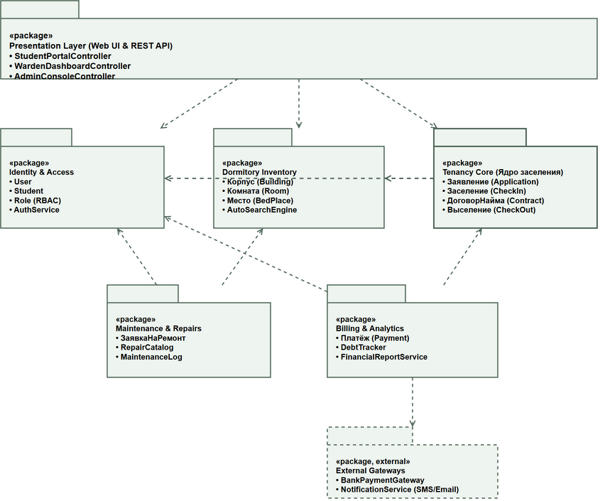
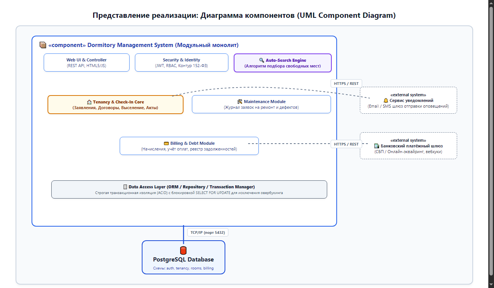
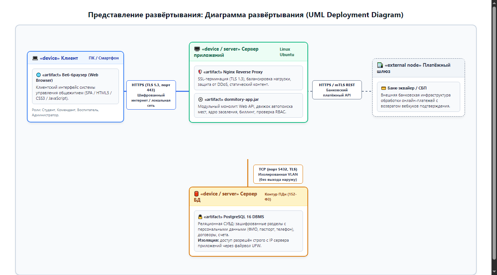

# Отчёт по практической работе №2
## Тема: «Разработка архитектуры программного проекта»

**Дисциплина:** МДК 02.01. Технология разработки программного обеспечения  
**Тема курсового проекта:** Разработка системы управления общежитием  
**Студент:** Витеник П.Л.  
**Группа:** ИТ-31, 3 курс  
**Организация:** Политехнический колледж БГТУ  

---

## 1. Цель работы, атрибуты качества и выбор архитектурного стиля

### Цель работы
Разработать многоуровневую архитектуру системы управления общежитием образовательной организации, сформулировать измеримые атрибуты качества, обосновать выбор архитектурного стиля «модульный монолит», построить логическое представление (пакеты), представление реализации (компоненты) и развёртывания (узлы), провести сценарный проход для выявления архитектурных рисков и зафиксировать ключевое решение в ADR-001.

### Измеримые атрибуты качества

| Атрибут качества | Неизмеримая (плохая) формулировка | Измеримая формулировка для системы управления общежитием |
|---|---|---|
| **Защита персональных данных (ПДн)** | «Система должна надёжно защищать данные студентов» | Паспортные данные, контактные телефоны и адреса жильцов хранятся в зашифрованном виде (AES-256) в изолированном контуре БД. Доступ строго ограничен ролевой моделью (RBAC): комендант видит жильцов только своего корпуса, студент — только свой профиль. В открытые системные логи персональные данные не попадают (маскирование). |
| **Надёжность и транзакционность распределения мест** | «Система не должна давать сбоев при заселении» | Процедура распределения места и заключения договора найма выполняется в рамках атомарной ACID-транзакции с пессимистической блокировкой койко-места (`SELECT ... FOR UPDATE`). Ситуация овербукинга (одновременное заселение двух студентов на одно место) исключена на 100% даже при параллельных запросах комендантов. |
| **Производительность автоматического поиска мест** | «Поиск комнат должен работать быстро» | Время выполнения алгоритма автоматического подбора свободных мест с фильтрацией по полу, курсу, факультету и корпусу составляет **не более 1.0 секунды** при базе в 5 000 студентов и 2 000 койко-мест при одновременной нагрузке до 50 запросов в секунду. |

### Ограничения проекта
- Команда: 3 человека.
- Срок: 4 месяца (1 семестр).
- Трудовой ресурс: 12 человеко-месяцев.
- Инфраструктура: единый виртуальный сервер (VPS) образовательной организации.

### Выбор архитектурного стиля и Матрица решений
Для системы выбран архитектурный стиль **«Модульный монолит» (Modular Monolith)**.

| Критерий оценки (Вес, 1–5) | Классический монолит | Модульный монолит | Микросервисы |
|---|:---:|:---:|:---:|
| Простота реализации силами 3 человек (вес: 5) | 5 (25) | 4 (20) | 1 (5) |
| Скорость вывода в эксплуатацию за 4 месяца (вес: 4) | 5 (20) | 4 (16) | 1 (4) |
| Чёткая изоляция критичных модулей и ПДн (вес: 4) | 2 (8) | 4 (16) | 5 (20) |
| Простота развёртывания и сопровождения (вес: 3) | 4 (12) | 5 (15) | 2 (6) |
| Надёжность транзакций без сетевых сбоев (вес: 4) | 5 (20) | 5 (20) | 2 (8) |
| **ИТОГО (Сумма: Оценка × Вес)** | **85** | **87 (Выбран)** | **43** |

*Обоснование:* Модульный монолит гарантирует соблюдение доменных границ при сохранении надёжных внутрипроцессных вызовов и локальных транзакций ACID, полностью исключая колоссальные издержки на оркестрацию микросервисов и распределённые транзакции (Saga).

---

## 2. Логическое представление: Диаграмма пакетов

*Рис. 1. Диаграмма пакетов (UML Package Diagram).*

### Распределение классов по пакетам:
1. `Presentation Layer (UI & API)`: `StudentPortalController`, `WardenDashboardController`, `AdminConsoleController`.
2. `Identity & Access`: `Студент (Student)`, `Пользователь (User)`, `Роль (Role: RBAC)`, `AuthService`.
3. `Dormitory Inventory`: `Корпус (Building)`, `Комната (Room)`, `Место (BedPlace)`, `AutoSearchEngine`.
4. `Tenancy Core (Ядро заселения)`: `Заявление (Application)`, `Заселение (CheckIn)`, `ДоговорНайма (TenancyContract)`, `Выселение (CheckOut)`.
5. `Maintenance & Repairs`: `ЗаявкаНаРемонт`, `Журнал дефектов`, `MaintenanceService`.
6. `Billing & Analytics`: `Платёж (Payment)`, `DebtTracker`, `FinancialReportService`.
7. `External Gateways [external]`: `BankPaymentGateway`, `NotificationService`.

*Анализ графа зависимостей:* Зависимости направлены строго сверху вниз (от UI к доменным пакетам и от ядра к справочникам). Циклические зависимости **полностью отсутствуют** (Directed Acyclic Graph).

---

## 3. Представление реализации: Диаграмма компонентов

*Рис. 2. Диаграмма компонентов (UML Component Diagram).*

### Таблица компонентов системы

| Компонент | Назначение | Ответственный | Хранилище данных |
|---|---|---|---|
| **Web UI & REST Controllers** | Пользовательский веб-интерфейс жильцов и персонала | Разработчики 1, 2, 3 | Stateless (JWT) |
| **Security & Identity** | Авторизация (RBAC), криптозащита ПДн | Разработчик 3 | PostgreSQL (схема `auth`) |
| **Auto-Search Engine** | Алгоритмический подбор свободных койко-мест | Разработчик 2 | In-memory кэш + PostgreSQL |
| **Tenancy Core** | Бизнес-логика заявлений, заселений и выселений | Разработчик 1 (Тимлид) | PostgreSQL (схема `tenancy`) |
| **Maintenance Module** | Обработка заявок на ремонт бытового фонда | Разработчик 2 | PostgreSQL (схема `maintenance`) |
| **Billing & Debt Module** | Начисления за наем, учет оплат, должники | Разработчик 3 | PostgreSQL (схема `billing`) |
| **Data Access Layer (DAL)** | Управление ACID-транзакциями и доступом к данным | Разработчик 1 (Тимлид) | PostgreSQL 16 Server |
| **External Payment Gateway** | Внешний шлюз онлайн-оплаты (СБП/эквайринг) | Внешняя система | Процессинг банка |
| **Notification Gateway** | Внешний сервис SMS и Email рассылок | Внешняя система | Облачный провайдер |

---

## 4. Представление развёртывания: Диаграмма развёртывания

*Рис. 3. Диаграмма развёртывания (UML Deployment Diagram).*

### Физическая топология и защита персональных данных (152-ФЗ):
1. **Клиентское устройство:** браузер подключается к серверу приложений по защищённому каналу **HTTPS (TLS 1.3, порт 443)**.
2. **Сервер приложений (Ubuntu Linux):** веб-сервер Nginx выполняет SSL-терминацию и проксирует трафик на монолитный артефакт `dormitory-app.jar`.
3. **Сервер базы данных (PostgreSQL 16):** вынесен в **изолированную виртуальную подсеть (Private VLAN)**. Прямой доступ из интернета закрыт наглухо через файрвол UFW.
4. **Связь серверов:** сервер приложений общается с СУБД по внутреннему протоколу **TCP (порт 5432)** с TLS-шифрованием трафика.
5. **Внешние шлюзы:** платёжный шлюз банка опрашивается через шифрованный HTTPS mTLS REST API.

---

## 5. Сценарный проход: проверка архитектуры

**Сценарий:** «Оформление заселения с автоматическим подбором свободного места и подписанием договора».

| Шаг | Действие | Пакет | Компонент | Узел | Риск / Что может пойти не так | Архитектурное решение |
|:---:|---|---|---|---|---|---|
| **1** | Студент подаёт заявку онлайн | `Presentation` | `Web UI Controller` | Клиент → Сервер приложений | Обрыв сети во время отправки | Идемпотентность запроса по `idempotency_key` |
| **2** | Комендант запускает автопоиск | `Inventory` | `Auto-Search Engine` | Сервер приложений | Конкурентный выбор места двумя комендантами | Подбор возвращает кандидатов, захват — строго в транзакции |
| **3** | Подтверждение выбора и бронь | `Tenancy Core` | `Tenancy & Check-In Core` | Сервер прил. → Сервер БД | **Гонка (Race condition): овербукинг** | **Блокировка `SELECT ... FOR UPDATE` в транзакции** |
| **4** | Формирование договора найма | `Tenancy Core` | `Tenancy & Check-In Core` | Сервер приложений | Сбой генератора PDF-бланка | Метаданные сохраняются в БД в транзакции, PDF асинхронно |
| **5** | Подписание договора студентом | `Presentation` | `Web UI Controller` | Сервер приложений | Студент не подписывает договор | Таймаут брони 48 часов, автоосвобождение места |
| **6** | Активация статуса и начисление | `Billing` | `Billing & Debt Module` | Сервер прил. → Сервер БД | Сбой создания счёта за первый месяц | Доменное событие `StudentCheckedInEvent` (Transactional Outbox) |

---

## 6. Запись архитектурного решения (ADR)

### ADR-001. Выбор архитектурного стиля «модульный монолит» и транзакционной изоляции при распределении мест

- **Статус:** Принято (Accepted)
- **Автор:** Витеник П.Л.

#### Контекст
Разрабатывается система управления общежитием силами 3 разработчиков за 4 месяца. Ключевые требования — 100% исключение ситуаций овербукинга (двойного заселения) при параллельной работе комендантов и соблюдение требований 152-ФЗ при хранении персональных данных.

#### Рассмотренные альтернативы
1. Микросервисы: колоссальные накладные расходы на сетевой транспорт, мониторинг и распределённые транзакции (Saga);
2. Классический немодульный монолит: высокий риск деградации в «спагетти-код»;
3. Модульный монолит: строгая модульность при простоте развёртывания и локальных ACID-транзакциях.

#### Решение
Принять архитектурный стиль **«Модульный монолит»** на базе реляционной СУБД PostgreSQL 16. Операцию бронирования и распределения койко-места выполнять в рамках транзакции уровня изоляции Read Committed с пессимистической блокировкой `SELECT ... FOR UPDATE`.

#### Последствия
- **Плюсы:** 100% защита от овербукинга на уровне СУБД; команда укладывается в срок 4 месяца; персональные данные изолированы в закрытом контуре.
- **Минусы:** вертикальное масштабирование приложения при росте нагрузки (для 2000 мест текущей мощности с избытком).

---

## 7. Фиксация результатов в репозитории Git

Материалы сохранены в каталоге `docs/architecture/`:
- `docs/architecture/packages.drawio`, `packages.png`
- `docs/architecture/components.drawio`, `components.png`
- `docs/architecture/deployment.drawio`, `deployment.png`
- `docs/architecture/architecture.md`

Коммиты:
1. `docs(architecture): add package and component diagrams`
2. `docs(architecture): add deployment diagram and quality attributes`
3. `docs(architecture): add scenario walkthrough and ADR`

---

## 8. Выводы и ответы на контрольные вопросы

### Выводы
В ходе практической работы №2 спроектирована целостная архитектура системы управления общежитием. Выбран модульный монолит, построены диаграммы пакетов, компонентов и развёртывания. Сценарный проход позволил выявить и устранить критический риск овербукинга мест с помощью пессимистической блокировки, зафиксированной в ADR-001.

### Ответы на контрольные вопросы
**1. Чем измеримая формулировка атрибута качества отличается от декларативной?**  
*Ответ:* Декларативная («система должна быть надёжной») не содержит критериев проверки. Измеримая указывает численные метрики, контекст и условия проверки («100% операций распределения мест выполняются в атомарной транзакции с исключением овербукинга»).

**2. Почему микросервисы не рекомендуются для небольших учебных проектов?**  
*Ответ:* Они привносят колоссальные инфраструктурные издержки (Service Mesh, распределённая трассировка, согласованность через Saga), отвлекая небольшую команду от разработки функциональности.

**3. Как диаграмма развёртывания подтверждает соблюдение 152-ФЗ?**  
*Ответ:* Она демонстрирует физическое размещение сервера БД в изолированной виртуальной локальной сети без прямого доступа из интернета, а также шифрование каналов связи HTTPS и внутреннего TLS.
